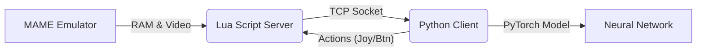

# 🕹️ MAME AI Training Framework

Ce projet est un framework complet permettant d'entraîner des agents d'Intelligence Artificielle (Reinforcement Learning) sur des jeux d'arcade classiques (Space Invaders, Pac-Man) via l'émulateur **MAME**.

Il utilise une architecture **Client-Serveur** où Python (le cerveau) communique avec MAME (le corps) via un socket TCP local, permettant un contrôle frame-par-frame et une lecture directe de la mémoire RAM du jeu.

---

## 🚀 Fonctionnement & Architecture

Le système repose sur trois composants principaux :

1.  **MAME & Lua Script (`PythonBridgeSocket.lua`)** :
    *   MAME exécute le jeu.
    *   Un script Lua intégré agit comme serveur. Il expose les adresses mémoire (RAM) et écoute les commandes d'input.
    *   Il synchronise l'émulation avec l'IA via un mécanisme de `wait_for` (attente de commandes).

2.  **Interface de Communication (`MameCommSocket.py`)** :
    *   Gère la connexion TCP brute entre Python et Lua.
    *   Envoie des commandes (ex: `execute P1_Button_1(1)`) et reçoit les états mémoire.

3.  **Cerveau IA (`AI_Mame.py` & Scripts de Jeu)** :
    *   Implémente des algorithmes de **Deep Reinforcement Learning** (Rainbow DQN, DreamerV2).
    *   **`invaders.py` / `pacman.py`** : Wrappers spécifiques à chaque jeu qui définissent les récompenses (rewards), extraient l'état (pixels ou RAM) et gèrent la boucle d'entraînement.



---

## ✨ Fonctionnalités Clés

*   **Algorithmes Avancés (Rainbow DQN)** :
    *   **Double DQN** & **Dueling DQN** pour une meilleure estimation des valeurs.
    *   **Noisy Nets** pour une exploration dynamique (remplace Epsilon-Greedy).
    *   **Prioritized Experience Replay (PER)** pour apprendre des moments importants.
    *   **N-Step Learning** pour une vision à plus long terme.
*   **Support Multi-Architectures** :
    *   **CNN (Convolutional Neural Network)** : L'IA "voit" l'écran (pixels bruts ou redimensionnés).
    *   **MLP (Multi-Layer Perceptron)** : L'IA lit directement la RAM (positions X/Y, états).
*   **Outils de Visualisation** :
    *   Serveur Web intégré (Flask) pour suivre les courbes de score en temps réel.
    *   Génération de graphiques `.png` automatiques.
    *   Enregistrement vidéo des meilleures parties.

---

## 📂 Structure du Projet

| Fichier | Description |
| :--- | :--- |
| `AI_Mame.py` | **Cœur de l'IA**. Contient les classes `DQNTrainer`, `DQNModel` (PyTorch), et le `ReplayBuffer`. |
| `invaders.py` | Script principal pour **Space Invaders**. Gère les rewards spécifiques (tuer alien, éviter bombe). |
| `pacman.py` | Script principal pour **Pac-Man**. Gère la lecture de la VRAM (labyrinthe) et des sprites. |
| `invaders_robot.py` | Un bot algorithmique (non-IA) pour Space Invaders, basé sur des règles logiques. |
| `MameCommSocket.py` | Gère le protocole de communication bas niveau avec Lua. |
| `ScreenRecorder.py` | Utilitaire pour capturer l'écran de jeu. |
| `dreamerv2.py` | Implémentation expérimentale de l'algo DreamerV2 (Model-Based RL). |

---

## 🛠️ Installation et Configuration

### Pré-requis
*   Python 3.8+
*   Bibliothèques : `torch`, `numpy`, `matplotlib`, `flask`, `keyboard`, `pygame`, `pywin32`.
*   **MAME** installé avec les ROMs nécessaires (`invaders`, `pacman`).

### Configuration des Chemins
⚠️ **Important** : Les scripts Python contiennent des chemins absolus qu'il faut adapter à votre machine.
Ouvrez `invaders.py` ou `pacman.py` et modifiez la méthode `launch_mame` :

```python
command = [
    r"C:\Chemin\Vers\Votre\mame.exe", # <--- Modifier ici
    "-autoboot_script", r"C:\Chemin\Vers\Plugins\PythonBridgeSocket.lua", # <--- Et ici
    ...
]
```

---

## 🎮 Utilisation

### Lancer un entraînement
Exécutez simplement le script correspondant au jeu :

```bash
python invaders.py
# ou
python pacman.py
```

### Raccourcis Clavier (Pendant l'entraînement)
Le focus doit être sur la fenêtre du terminal/console pour que les touches fonctionnent.

| Touche | Action |
| :--- | :--- |
| **F2** | 🛑 Arrêt propre et sauvegarde du modèle. |
| **F3** | 🐞 Désactiver le mode Debug (console moins verbeuse). |
| **F4** | 🐛 Changer le niveau de Debug (0-3). |
| **F5** | ⏩ Augmenter la vitesse d'émulation (Throttle). |
| **F6** | ⏪ Réduire la vitesse d'émulation. |
| **F7** | 📊 Générer manuellement le graphique des scores. |
| **F8** | 👁️ Afficher ce que l'IA "voit" (Input Frame/State). |
| **F9** | 🔄 Basculer entre mode **Exploration** (Apprentissage) et **Exploitation** (Jeu pur). |
| **F10/F11** | 🎛️ Ajuster manuellement le taux d'exploration (Epsilon) (si NoisyNet inactif). |

---

## 📊 Suivi des Résultats
*   Les logs sont affichés dans la console.
*   Un serveur web local est lancé sur `http://localhost:5000` pour voir les graphiques d'évolution.
*   Les modèles (`.pth`) et les buffers (`.buffer`) sont sauvegardés automatiquement à la racine.
