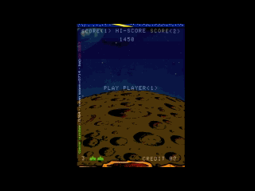

# MAME AI - Apprentissage Automatique pour Space Invaders (1978)

Ce projet a pour ambition de développer différentes intelligences artificielles capables de jouer au jeu d'arcade classique *Space Invaders* (version originale de 1978) en utilisant l'émulateur MAME. L'interaction avec l'émulateur se fait via un script LUA et un pont Python (PythonBridgeSocket).

L'objectif principal est d'explorer et de comparer les performances de plusieurs approches d'apprentissage par renforcement :

* **DQN-CNN (Deep Q-Network avec Réseau de Convolution)** : Utilise l'image brute du jeu (ou une version prétraitée) comme entrée.
* **DQN-MLP (Deep Q-Network avec Perceptron Multicouche)** : Utilise un vecteur d'état extrait de la mémoire RAM du jeu (positions des aliens, du joueur, des tirs, etc.) comme entrée.
* **DreamerV2** : Un agent plus avancé basé sur un modèle du monde appris, capable de planifier en "rêvant" des séquences futures.

## 🚀 Objectif du Projet

Le but est de créer des agents IA performants pour *Space Invaders*, tout en fournissant une plateforme flexible pour expérimenter avec différents algorithmes d'apprentissage par renforcement et techniques d'extraction d'état dans un environnement de jeu rétro.

Nous cherchons à :
1.  Implémenter une communication robuste entre Python et MAME via LUA.
2.  Développer des extracteurs d'état pertinents (RAM et/ou pixels).
3.  Entraîner et évaluer les agents DQN-CNN, DQN-MLP et DreamerV2.
4.  Analyser et comparer leurs comportements, performances et vitesses d'apprentissage.
5.  Fournir des outils de visualisation pour suivre la progression de l'entraînement.

## 📜 Description des Fichiers

Voici un aperçu des principaux fichiers du projet :

### Scripts LUA (pour MAME)

* **`PythonBridgeSocket.lua`**:
    * **Rôle** : C'est le cœur de la communication côté MAME. Ce script LUA démarre un serveur socket dans l'environnement MAME.
    * **Fonctionnalités** :
        * Attend des connexions d'un client Python.
        * Reçoit des commandes du client Python (par exemple, lire/écrire dans la mémoire du jeu, exécuter des actions de jeu comme "tirer" ou "aller à gauche").
        * Exécute ces commandes dans l'émulateur.
        * Renvoie les résultats (par exemple, les valeurs lues en mémoire, confirmations d'action) au client Python.
        * Utilise `zlib` pour compresser les données envoyées à Python afin d'optimiser la communication.
        * Gère la configuration des entrées spécifiques au jeu (par exemple, les contrôles de Space Invaders).
        * Peut afficher des informations de débogage à l'écran de MAME.

### Scripts Python

* **`invaders.py`**:
    * **Rôle** : Fichier principal orchestrant l'entraînement des IA pour Space Invaders.
    * **Fonctionnalités** :
        * Lance MAME avec le script LUA `PythonBridgeSocket.lua`.
        * Initialise la communication avec MAME via `MameCommunicator`.
        * Contient la boucle principale d'entraînement :
            * Récupère l'état du jeu (via `get_state` pour MLP ou `get_state_full_screen` pour CNN/Dreamer).
            * Demande à l'agent IA de choisir une action.
            * Envoie l'action à MAME pour exécution.
            * Calcule la récompense.
            * Stocke les transitions (état, action, récompense, nouvel état, terminé) dans le buffer de relecture.
            * Lance les étapes d'entraînement de l'agent (`trainer.train_step()`).
        * Gère la configuration des différents modèles (DQN-MLP, DQN-CNN, DreamerV2) et de leurs hyperparamètres.
        * Définit les fonctions de récompense.
        * Gère la sauvegarde et le chargement des modèles et des buffers de relecture.
        * Produit des graphiques de performance (scores moyens, epsilon/sigma) via Matplotlib et les expose via `GraphWebServer`.
        * Permet des interactions via le clavier (débogage, changement de mode, etc.).

* **`AI_Mame.py`**:
    * **Rôle** : Contient les classes et la logique fondamentales pour les agents DQN (MLP et CNN).
    * **Composants principaux** :
        * `TrainingConfig`: Une dataclass pour stocker et gérer tous les hyperparamètres de l'entraînement.
        * `GPUReplayBuffer`: Implémentation d'un buffer de relecture (Experience Replay), avec support optionnel pour le Prioritized Experience Replay (PER) et l'optimisation mémoire pour les données CNN (stockage sur CPU en `uint8`).
        * `NStepTransitionWrapper`: Gère les transitions n-step pour le calcul des retours.
        * `NoisyLinear`: Implémentation d'une couche linéaire "bruyante" pour l'exploration (NoisyNets).
        * `DQNModel`: L'architecture du réseau de neurones, supportant :
            * Des entrées MLP (vecteur d'état).
            * Des entrées CNN avec différentes configurations (`deepmind`, `precise`, `original`).
            * Des options comme Dueling DQN et NoisyNets.
        * `DQNTrainer`: La classe principale pour entraîner les agents DQN. Elle gère :
            * La sélection d'actions (epsilon-greedy ou via NoisyNets).
            * La mise à jour du réseau (calcul de la perte, rétropropagation).
            * La synchronisation du réseau cible (target network).
            * La sauvegarde et le chargement des modèles et des buffers.
            * La gestion du mode exploration/exploitation.
        * `GraphWebServer`: (Déplacé ici, mais peut aussi être dans un fichier séparé comme `graph_web_server.py`). Un simple serveur Flask pour afficher les graphiques de progression de l'entraînement dans un navigateur web.
        * `TeeLogger`: Classe utilitaire pour rediriger les sorties `print` vers la console et un fichier de log simultanément.

* **`dreamerv2.py`**:
    * **Rôle** : Implémente l'agent DreamerV2.
    * **Composants principaux** :
        * `ConvEncoder` / `ConvDecoder`: Réseaux de convolution pour encoder les observations (images) en vecteurs latents et les décoder pour la reconstruction.
        * `RSSM (Recurrent State Space Model)`: Le cœur de Dreamer. Un modèle récurrent (GRU) qui apprend à prédire les états futurs latents (dynamique du monde). Il maintient un état déterministe (`h`) et un état stochastique (`z`).
        * `RewardModel`: Un réseau de neurones qui apprend à prédire la récompense à partir des états latents du RSSM.
        * `ValueModel (Critic)`: Un réseau de neurones qui apprend à estimer la valeur (somme des récompenses futures attendues) d'un état latent.
        * `ActorModel`: Un réseau de neurones qui apprend la politique, c'est-à-dire quelle action prendre à partir d'un état latent.
        * `DreamerTrainer`: La classe principale pour l'entraînement de l'agent DreamerV2. Elle gère :
            * La boucle d'apprentissage du modèle du monde (RSSM, encodeur/décodeur, modèle de récompense).
            * La boucle d'apprentissage de l'acteur et du critique en "rêvant" des trajectoires à partir du modèle du monde appris.
            * La sélection d'actions pendant l'interaction avec l'environnement.
            * La sauvegarde et le chargement du modèle complet et du buffer de relecture.

* **`MameCommSocket.py`**:
    * **Rôle** : Client Python qui se connecte au serveur LUA `PythonBridgeSocket.lua` tournant dans MAME.
    * **Fonctionnalités** :
        * Établit une connexion socket avec le script LUA.
        * Envoie des commandes (chaînes de caractères) au script LUA (par exemple, `read_memory 20F8`, `execute P1_left(1)`). Les messages sont terminés par `__end__`.
        * Reçoit les réponses du script LUA.
        * Utilise `zlib` pour décompresser les données reçues du script LUA.
        * Fournit une méthode `communicate` simple pour envoyer des requêtes et recevoir des réponses.

* **`graph_web_server.py`**:
    * **Rôle** : Met en place un serveur web simple utilisant Flask.
    * **Fonctionnalités** :
        * Sert les images PNG (graphiques de performance générés par Matplotlib dans `invaders.py`) situées dans un dossier spécifié (par défaut `./graphs/`).
        * Peut être configuré pour afficher automatiquement le graphique le plus récent ou une liste de tous les graphiques disponibles.
        * Permet de visualiser la progression de l'entraînement à distance via un navigateur web.

* **`ScreenRecorder.py`**:
    * **Rôle** : Utilitaire pour interagir avec OBS (Open Broadcaster Software) via son plugin `obs-websocket`.
    * **Fonctionnalités** :
        * Se connecte à OBS.
        * Permet de démarrer et d'arrêter l'enregistrement de l'écran.
        * Utile pour capturer des vidéos des performances de l'IA. (Nécessite OBS configuré et `obs-websocket` installé et activé).

## 🛠️ Comment Utiliser (Instructions de Base)

1.  **Prérequis**:
    * MAME (avec la ROM Space Invaders)
    * Python 3.x
    * Bibliothèques Python : PyTorch, NumPy, Matplotlib, Flask, python-socketio, obswebsocket (si `ScreenRecorder.py` est utilisé), pygame, keyboard, psutil, pywin32, colorama.
    * Dépendances LUA pour MAME : `luasocket`, `luazlib`, `lubase64` (généralement incluses avec les versions récentes de MAME qui supportent LUA).
2.  **Configuration**:
    * Vérifiez les chemins d'accès à l'exécutable MAME et au script LUA dans `invaders.py`.
    * Placez `PythonBridgeSocket.lua` dans un endroit accessible par MAME (par exemple, le dossier `plugins` de MAME).
3.  **Lancement**:
    * Exécutez `python invaders.py`.
    * Le script devrait lancer MAME, établir la connexion, et commencer l'entraînement.
    * Vous pouvez accéder à `http://localhost:5000` (ou l'IP de votre machine sur le port 5000) pour voir les graphiques de performance.

## 🤝 Contribution

Les contributions, suggestions et rapports de bugs sont les bienvenus !

